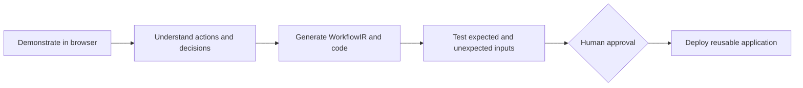

# Flowwright

**Show the work. Ship the workflow.**

Flowwright is an AI workflow compiler that learns a browser-based process from a human demonstration and converts it into a structured, tested, executable application.

## Product overview

People repeat browser tasks because the work contains context, decisions, and exceptions that generic recorders do not understand. Flowwright records a demonstration, extracts meaningful actions, identifies variables and safety boundaries, compiles a Workflow Intermediate Representation (WorkflowIR), and generates tests before a human approves high-impact actions.

Existing workflow builders require users to understand automation logic. Autonomous agents improvise on every execution. Flowwright learns the process first, keeps uncertainty visible, and makes the compiled graph inspectable.

## How it works



The core innovation is a compiler boundary: human evidence is normalized into a typed intermediate representation before code generation. The initial demo uses a deterministic analyzer; the OpenAI analyzer is isolated behind the same interface.

## Prototype status

Working today:

- Next.js dashboard with `/`, `/record`, `/workflows/demo`, `/tests`, `/code`, and `/generated/invoice-processor`.
- Local screen recording with `getDisplayMedia`, preview, download, elapsed time, and optional event-log import.
- FastAPI health, sample workflow, strict AI analysis, real test execution, evidence processing, trusted artifact, and invoice runtime endpoints.
- Pydantic WorkflowIR, matching Zod schema, synthetic invoice fixtures, and generated graph using `@xyflow/react`.
- Chrome Manifest V3 extension build that captures safe clicks, navigation, and non-sensitive input events, persists the local event log, and exports JSON.
- GitHub Pages deployment of the Next.js frontend as a static export.
- Demo mode works without an OpenAI key.

Roadmap: production browser executor, richer event normalization, persistent storage, and deployment automation. OpenAI-backed compilation is implemented behind configuration but remains unverified here because no key is available.

The prototype supports a controlled browser workflow only. It does not automate arbitrary desktop applications, autonomously execute sensitive actions, use real financial data, or provide authentication, billing, team collaboration, or enterprise controls.

## Repository structure

```text
apps/web          Next.js App Router frontend
apps/api          FastAPI backend and tests
apps/extension    Chrome Manifest V3 event-capture scaffold
packages/...      WorkflowIR Zod package and sample workflow
examples/...      Synthetic invoice and purchase-order data
docs              Supporting static product documentation
scripts           Schema export and setup verification
```

## Technology stack

Node.js 24 LTS, pnpm, Next.js, React, TypeScript, Tailwind CSS, shadcn/ui-compatible components, `@xyflow/react`, Zod, Playwright, Python 3.12+, FastAPI, Pydantic, pydantic-settings, OpenAI Python SDK, OpenCV, FFmpeg-compatible video decoding, Playwright Python, pytest, HTTPX, and SQLite for local development.

## Local setup

Prerequisites: Node.js 24 LTS, pnpm 11+, Python 3.12+, uv, and (for video extraction) FFmpeg codecs available to OpenCV.

On Windows, if `pnpm` is not recognized after installing Node.js, run `corepack enable` once and open a new terminal. The repository pins pnpm 11.7.0 through `packageManager`, so local and CI installs use the same version.

```bash
pnpm install
cd apps/api && uv sync
```

Copy `.env.example` to a local `.env` only when needed. Never commit it.

Frontend:

```bash
pnpm dev:web
pnpm --filter @flowwright/web build
pnpm --filter @flowwright/web start
```

The `start` command serves the generated static export locally after `build`.

Backend:

```bash
cd apps/api
uv run uvicorn app.main:app --reload --port 8000
uv run pytest
```

Chrome extension:

```bash
pnpm dev:extension
```

Then load `apps/extension/build` as an unpacked extension in `chrome://extensions` with Developer mode enabled. The extension requires explicit start/stop actions and does not upload event logs.

Complete checks:

```bash
pnpm check
```

## Environment variables

`FLOWWRIGHT_DEMO_MODE=true` is the default and requires no API key. To use the isolated OpenAI analyzer, set `OPENAI_API_KEY`, `OPENAI_MODEL`, and `FLOWWRIGHT_DEMO_MODE=false` in the backend environment. `CORS_ALLOWED_ORIGINS` must list explicit origins. `MAX_UPLOAD_SIZE_MB` controls ephemeral video uploads. See `.env.example` and `apps/api/.env.example`.

## API

- `GET /` — deployed API landing response with links to health and OpenAPI docs.
- `GET /health` — service status.
- `GET /api/v1/workflows/demo` — validated synthetic invoice WorkflowIR.
- `POST /api/v1/workflows/analyze` — compile processed evidence with the configured OpenAI analyzer. Demo mode deliberately returns an explicit unavailable response; use `/workflows/demo` for the checked-in sample.
- `POST /api/v1/workflows/test` — execute the synthetic invoice cases through the restricted runtime and return a run record.
- `POST /api/v1/workflows/resolve` — answer workflow uncertainties before generation.
- `POST /api/v1/workflows/generate` and `GET /api/v1/workflows/{workflow_id}/artifact` — generate/download the trusted invoice artifact.
- `POST /api/v1/invoices/process` — run one synthetic invoice in the generated mini-application runtime.
- `POST /api/v1/invoices/approve` — record an explicit human approval for an exact-match synthetic invoice; no external action is executed.
- `POST /api/v1/media/process-demonstration` — extract bounded JPEG frames, optional audio/transcript status, browser events, and a timestamped evidence timeline without persisting media.
- `POST /api/v1/media/keyframes` — validate a video, extract metadata for a small set of key frames, and delete the temporary file.

## WorkflowIR example

```json
{
  "id": "invoice-approval-demo",
  "version": "0.1.0",
  "steps": [
    { "id": "compare_totals", "type": "condition", "requires_approval": false }
  ],
  "confidence": 0.94
}
```

The authoritative full schema is `apps/api/app/models/workflow.py`; its JSON Schema export is `packages/workflow-schema/workflow.schema.json`.

## Invoice demo

The four synthetic cases are exact match → `approval_required`, amount mismatch → `exception`, missing purchase order → `human_review`, and unreadable invoice number → `human_review`. Approval remains a human gate even for an exact match.

## Testing and security

Run `cd apps/api && uv run pytest` for backend tests, `pnpm --filter @flowwright/web test:e2e` for the Playwright smoke test, and `pnpm check` for frontend/extension checks. Keys never enter frontend code. Recordings are local and not persisted by the prototype. Generated code must be reviewed and must not be used as arbitrary shell execution. See `SECURITY.md` for limitations.

## Deployment guidance

GitHub Pages builds and deploys the Next.js frontend static export from `apps/web/out` with the `/Flowwright` project-site base path. To enable live backend actions on Pages, create an Actions repository variable named `FLOWWRIGHT_API_URL`; the Pages workflow injects it as `NEXT_PUBLIC_FLOWWRIGHT_API_URL`. Without that variable, the public site remains a static product/demo surface and clearly reports unavailable backend actions. The FastAPI service targets Railway, Render, or Fly.io. Future PostgreSQL storage can use Neon or Supabase; future media storage can use Cloudflare R2 or Amazon S3. Credentials and deployment actions are intentionally not included.

## Roadmap and hackathon demo flow

1. Start the API in demo mode and the frontend.
2. Record a browser demonstration, stop it, describe the task, and choose **Analyze demonstration**. Key-frame extraction is explicit and temporary.
3. Open the compiled workflow graph and inspect variables, decisions, and approval gates.
4. Open test results for all four synthetic cases.
5. Show the extension scaffold and static product site.

## Contributing and license

See `CONTRIBUTING.md` for setup and pull-request expectations. Flowwright is released under the Apache License, Version 2.0 in `LICENSE`.
